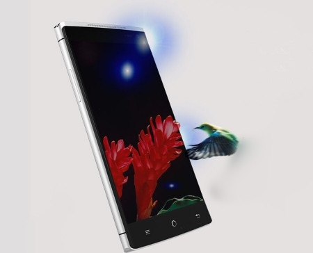
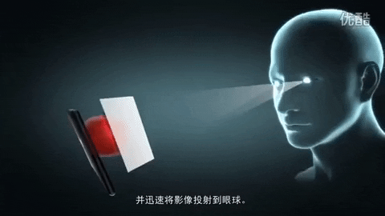

# 3DVideoPlayer (Mik-el)

### A 3D video player for Android that allows to watch videos in 3D without using glasses.
### It uses Holographic 3D and eye-tracking technologies.

# [Click here to see Everything on Github!][github]

   [github]: <http://bit.ly/3q7dz1g>
