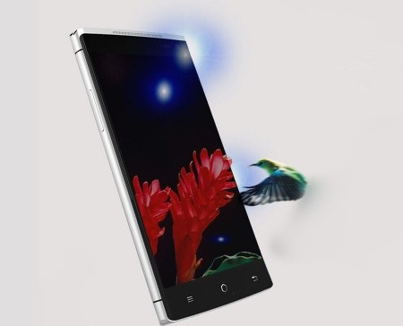
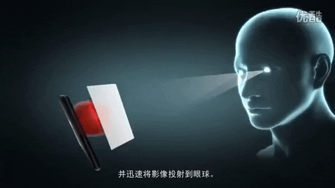

# 3DVideoPlayer (Mik-el)

This is a 3D video player for Android that allows to watch videos in 3d without using glasses.
It uses Holographic 3D and eye-tracking technologies.
([patent][patent])

# Device supported:
 - Brand: EStar
 - Model: Takee 1 (cheaper version of 2015 with single rear camera). 
 Quick specs [here][quickdevinfo]
 Detailed specs [here][detdevinfo]

# Download 3D libraries:
This app needs 3d libraries to work. Unfortunately some custom Roms don't include them, but I extracted them from the last stock rom and made a guide to import them correctly in any custom rom, you can download the libraries [here][3dlibs] 

# Stock and custom ROMs for Takee 1:
[here][takeeroms] 

# Get involved :
 - We talk about this app on the international [XDA Forum][takeexda] community 
 - We also tried to involve the russian community translating and posting our summaries on the [4pda forum][takee4pda]
 - My takee1 is destroyed :( Would you like to donate your device or help me in other ways?

# Origin of this code:
Source code of the official app in stock ROMs.

# Advantage of this fork:
* Converted the source code from an old Eclipse project to a new Android Studio project. (Mik-el)
* Optimized the code with Proguard (Mik-el)
* Added 4 new languages: Italian, Spanish, Portuguese, German. (View Credits)
* Improved original English text 

# Relevance:
This app is the cornerstone for future developments of:
* Takee 1
* other 3D smartphones ([more][3dphones])
* other 3D devices with eye-tracking and Stereoscopic displays such as New Nintendo 3DS ([more][s3Ddevices])

# App Download
The download of this app is free. ([link][apkv2] - use slower download) but if you'll like to help me:

# My Social pages

|  |  |
| ------ | ------ |
| XDA Forum | [link][xda] |
| Tech Blog | [link][cam] |
| Instagram | [link][insta] |
| Youtube | [link][yt] |

# Credits
* [Mik-el][xda] : developer, italian translator
* [YuriRM][yuri]: coordinator, portuguese translator
* [io2345][io2345]: tester, german translator
* [Kano3D][kano3d]: spanish translator

   [xda]: <http://bit.ly/2NBnhqB>
   [insta]: <http://bit.ly/mikel_insta>
   [yt]: <http://bit.ly/mikel_YT>
   [quickdevinfo]: <http://bit.ly/67ik9>
   [detdevinfo]: <http://bit.ly/2KWudAZ>
   [3dlibs]: <http://bit.ly/2viBkcd>
   [takeexda]: <http://bit.ly/2tL9Mvh3>
   [takee4pda]: <http://bit.ly/2Dst1z0>
   [takeeroms]: <http://bit.ly/2VmNQpD>
   [paypal]: <>
   [3dphones]: <https://en.wikipedia.org/wiki/List_of_3D-enabled_mobile_phones>
   [s3Ddevices]: <https://forum.xda-developers.com/showpost.php?p=79098051&postcount=1399>
   [yuri]: <https://forum.xda-developers.com/member.php?u=7147494>
   [io2345]: <https://forum.xda-developers.com/member.php?u=6026343>
   [kano3d]: <http://www.tridimensional.info>
   [patent]: <http://bit.ly/2LvEd4r>
   [apkv1]: <http://bit.ly/Mk3d001>
   [apkv2]: <http://www.filefactory.com/file/257xh8gpewhz/Mik-el%203DVideoPlayer%20v2.apk>
   [cam]: <https://cam.tv/mik_el_tech>
